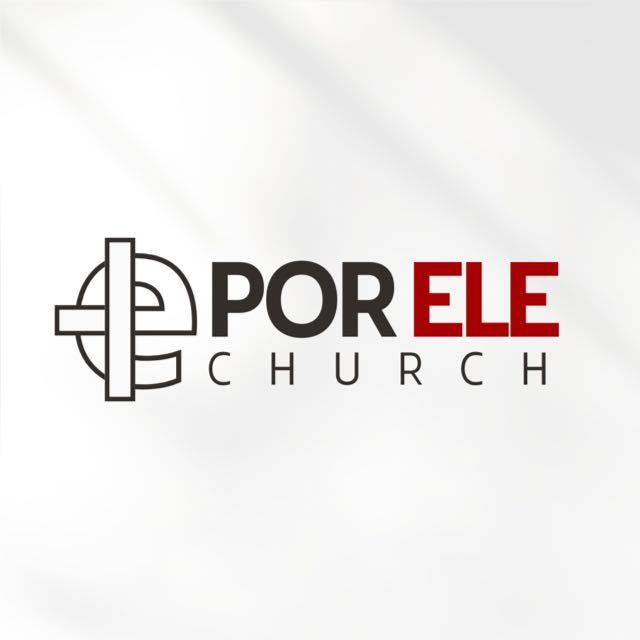

  

<h1 align="center">Site Institucional - Por Ele Church</h1>

---

### 🙏 Sobre o projeto

Este repositório contém o desenvolvimento do site institucional da **Por Ele Church**, uma igreja cristã comprometida em **levar o amor de Deus às pessoas**, promover a comunhão e impactar vidas através da fé, da Palavra e do serviço à comunidade.

O site foi criado para facilitar o acesso às informações da igreja, divulgar eventos, cultos e ministérios, além de oferecer recursos para membros e visitantes.

---

### ✝️ Funcionalidades implementadas

O site foi pensado com um visual acolhedor, moderno e fácil de navegar, com as seguintes seções:

- ✅ Página inicial com mensagem de boas-vindas e chamada para os cultos
- ✅ Informações sobre a igreja:
- ✅ Missão, Visão e Valores
- ✅ História da Por Ele Church
- ✅ Programação semanal:
- ✅ Cultos, células e eventos especiais
- ✅ Área de Ministérios (jovens, casais, infantil, louvor, etc.)
- ✅ Formulário de contato e pedidos de oração
- ✅ Integração com Instagram e YouTube (para vídeos e transmissões)
- ✅ Botão do WhatsApp para atendimento e acolhimento
- ✅ Mapa de localização e redes sociais
- ✅ Site 100% responsivo e otimizado para celulares

---

### 🛠️ Tecnologias utilizadas

- **HTML5 / CSS3 / JavaScript** — Estrutura e interatividade do site
- **Bootstrap** — Layout responsivo e moderno
- **Git & GitHub** — Controle de versão

---

### 📌 Observações

- O site da **Por Ele Church** foi desenvolvido com foco em **acolhimento, clareza e conexão com os visitantes**.
- Pode ser expandido futuramente com uma área de membros, cadastro de voluntários ou plataforma de doações online.

---

### 📚 Créditos

Agradecimentos à liderança e equipe da **Por Ele Church** por compartilhar a visão do projeto e confiar no desenvolvimento de uma ferramenta que conecta fé, tecnologia e pessoas.

> “Tudo é por Ele, e para Ele.” — *Romanos 11:36*
